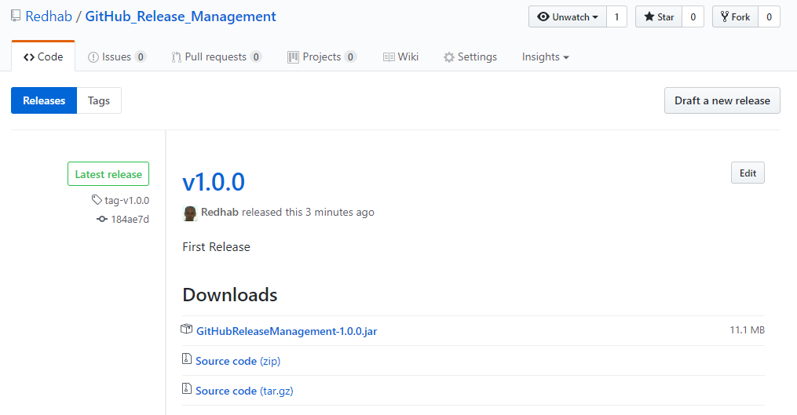

# GitHub Release Management

**GitHubReleaseManagement** : Library (jar file) to manage GitHub repository releases and their assets (artifacts): [See release documentation](https://help.github.com/articles/about-releases/)


The Library uses [GitHub API v3](https://developer.github.com/v3/)


The library can be used in Gradle, Maven, Jenkins, ...

### Features ###
 * Support multiple actions:
    * 'create': Create a new Release and upload assets.
    * 'delete': Delete an existent release. Only the release will be deleted, not the associated tag. As of today there are no api available to delete tags.
    * 'latest': Get information of the latest release available.
    * 'list'  : List all the available releases.
 * No external dependencies  requires. 
 
    
    
### Usage ###
```
java -jar GitHubReleaseManagement-<version> <action> <user> <token> <repo> <version> <branch> <assets> <notes>

debug  : (required) Available values: true, false. 
action : (required) Available values: 'create', 'delete', 'latest', 'list'
         -'create': Creates a release and optionally upload artifacts (assets)
         -'delete': Deletes an existent release. The 'version' number is required.
         -'latest': Retrieves details about the latest release.
         -'list'  : Lists all the available releases.
owner  : (required) GiHub user or organisation
token  : (required) GiHub personal access token. See https://github.com/blog/1509-personal-api-tokens
repo   : (required) GiHub repository
version: (required for action='create' & 'delete') Release version
branch : (required for action='create') GiHub repository branch to release from. Ex'master'
assets : (Optional used with action='create') Assets to attach to the release.
         - Format: <file1>,<file2>,...
           Comma delimited List of file path
notes  : (Optional used with action='create') Release notes associated to the Release

Important:
----------
The naming convention for the release and the associated tag are based on the 'version' parameter with following format:
 - Release name = v<version>
 - Tag name     = tag-<version>
```        

In Gradle:
```groovy
task githubRelease (dependsOn: Jar, type: JavaExec ) {
    classpath = sourceSets.main.runtimeClasspath

    main = 'GitHubReleaseManagement'

    args += false  // Create a new Release
    args += 'create'  // Create a new Release
    args += this.properties['github.release.user'] // See gradle.properties
    args += this.properties['github.release.token'] // Can be passed in the commandline line as Gradle property: -P
    args += rootProject.name // Repository Name === Project name
    args += version          //
    args += 'master'         // branch
    args += "${configurations['archives'].allArtifacts.getFiles().collect().join(',')}" // List all the generated library files as assets
    args += "First Release"
}
```

Output 
```
> Task :githubRelease
- Parameters:
  - Action : create
  - Owner  : Redhab
  - Token  : ***************
  - Repo   : GitHub_Release_Management
  - Version: 1.0.0
  - Branch : master
  - Assets : C:\github_release_mgnt\build\libs\GitHubReleaseManagement-1.0.0.jar
  - Notes  : First Release


- Create a Release
  - Successful Release creation
  - Upload assets: 'c:\github_release_mgnt\build\libs\GitHubReleaseManagement-1.0.0.jar'
    - Asset #1:
      - Path: c:\github_release_mgnt\build\libs\GitHubReleaseManagement-1.0.0.jar
      - Name: GitHubReleaseManagement-1.0.0.jar
      - ContentType: null
      - Upload was successful:
        - Download URL: https://github.com/Redhab/GitHub_Release_Management/releases/download/tag-v1.0.0/GitHubReleaseManagement-1.0.0.jar

```




Gradle: This library is intended to be used in different context (CLI, Gradle, Maven, Jenkins, ...) but if you are looking for a better integration in Gradle to create Releases, have a look at the elegant [gradle-github-plugin](https://github.com/riiid/gradle-github-plugin) 

This repository uses GitHubReleaseManagement for his own release.


### Downloading

You can download released version from the [release page](https://github.com/Redhab/GitHub_Release_Management/releases)

### Development
#### Requirement
* Requires JDK 8

#### Building
To build the library

    ./gradlew fatJar

### Contribution guidelines ###

*TODO*

### Who do I talk to? ###

Redha  - email: redhab@gmail.com 