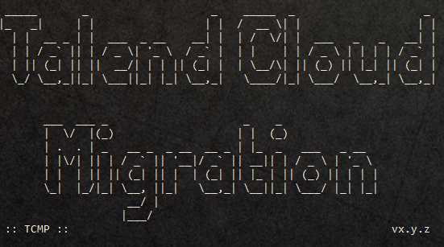
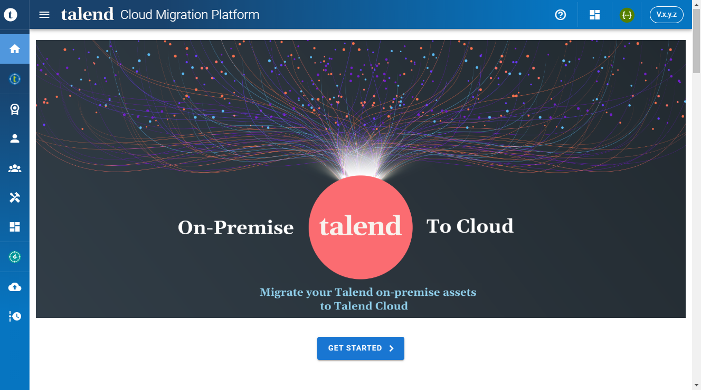

# Talend Cloud Migration Platform (TCMP)

## Introduction

The Talend Cloud Migration Platform (TCMP) main objective is helping the planning and the migration of the Talend Administration Center assets to Talend Cloud Management Console.

The planning is done through the collection and aggregation of the asset inventory of the on-premise Talend platform.

In this current version, TCMP supports the inventory and migration of Talend Users, Groups, Projects and their respective User/Groups authorizations.

## Installation

Unzip the `tcmp-@CURRENT_VERSION@.zip` file in a dedicated folder.

File List:
```yaml
- <install dir>
    - tcmp-@CURRENT_VERSION@.jar
    - start_tcmp.bat
    - start_tcmp.sh
    - HELP.md
    - img/*.png
```

## Requirement

Java 8 or greater

## Starting the application

Run the `start_tcmp.bat` or `start_tcmp.sh` based on your Operating System.

The application will display the following message.


 
(vx.y.z = v@CURRENT_VERSION@)

### Windows OS

A web page will be launched in your default browser when you run `start_tcmp.bat`

> **Important**
>
> The page will probably show a timeout message after a few seconds with an error
>
> `The site can't be reached.`
>
> ***Please wait*** The page will refresh automatically at the end of the initial application initialization (handful of seconds)
>
> If you did close the web page, you can use the url [http://localhost:7777](http://localhost:7777) to access the application.
>

### Other OS

Open the url [http://localhost:7777](http://localhost:7777) in your preferred browser.

Your web browser should display the following page:



(vx.y.z = v@CURRENT_VERSION@)

## Configuration

The default Web port of TCMP is **7777**. If necessary, you can change it in the script `start_tcmp.bat|sh` file:

```cmd
SET HTTP_PORT=7777
```

or

```bash
HTTP_PORT=7777
```

## Documentation

A documentation is included in the web application. It provides a user guide and step by step instructions for a Talend Cloud Migration.

You can access it by clicking on the `Get Started >`  button in the front page or on the question mark  `?`  icon in the main toolbar.

## Stopping the application

To terminate the application, close the command windows or press `Ctl+C`.

## Data persistence

All the data typed in or collected by the application are persited and available for future executions.

The data are saved locally in a dedicated H2 database located in the user home directory:

Example:
- Windows. Default: `c:\Users\<username>\.talend\tcmp\repo.mv.db`    

- Linux. Default: `/home/<username>/.talend/tcmp/repo.mv.db`    

## Known limitations

- Refreshing the browser page may display a `404` error message. 
  If it's the case, you can go back to the root url: [http://localhost:7777](http://localhost:7777)

- To leverage the **printing** capability provided by TCMP; a **Chromium based browser is required** (Google Chrome, Microsoft Edge, Brave, ...).


## Release Notes

@RELEASE_NOTES@
